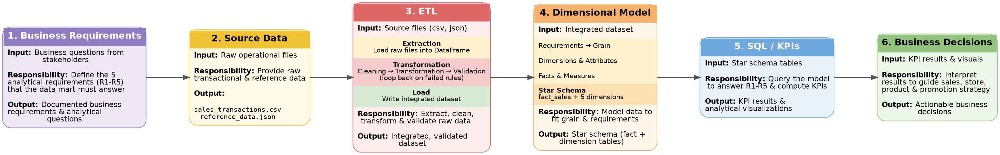
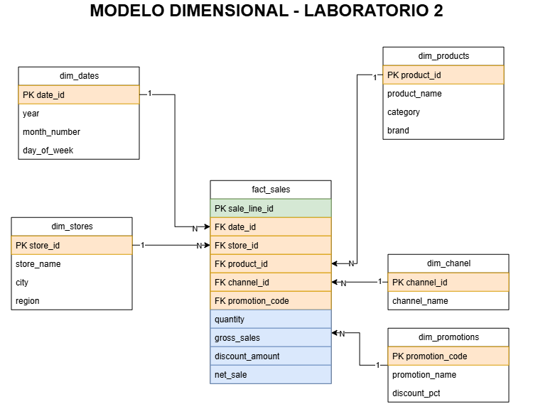

# Lab 2 – ETL & Dimensional Modeling: Sales Data Mart

## 1. Project Objective and Business Scenario

A retail technology company operates two physical stores and one national online store. Management wants to consolidate six months of sales information into a Data Warehouse to support recurring analytical queries and future dashboards. The analytical solution must be designed around the business questions below. The model should contain the data necessary to answer them, without simply copying every source field into the Data Warehouse.
## 2. System Architecture / Pipeline Diagram

## 3. Five Business Requirements

| # | Business Requirement |
|---|---|
| R1 | Monitor monthly net sales trends and identify periods of growth or decline. *(date, sales)* |
| R2 | Compare sales performance across stores and sales channels over time. *(sales, store, channel, date)* |
| R3 | Identify the best-performing product categories and brands, based on revenue and units sold. *(product category, brand)* |
| R4 | Evaluate promotion performance by comparing sales, units, and discounts across different promotion types. *(promotions)* |
| R5 | Analyze gross revenue and gross margin by product category, store, and month. *(product, store, date)* |

## 4. Business Process and Declared Fact-Table Grain

**Business process:** Retail sales transactions.

**Declared grain:** Each row in `fact_sales` represents one sales transaction, on a specific date, at a specific store, through a specific sales channel, for a specific product purchased under a specific promotion (including cases with no promotion applied).

## 5. Star Schema Diagram and Design Justification

**Design justification:**
A star schema was chosen because the declared grain of `fact_sales` (one row per sale line, per date/store/channel/product/promotion) maps directly onto a single fact table surrounded by independent, denormalized dimension tables (`dim_dates`, `dim_stores`, `dim_products`, `dim_chanel`, `dim_promotions`). This structure:

- Directly supports all five business requirements, since each requirement only needs a join between `fact_sales` and one or two dimensions (e.g., R1 → `dim_dates`; R2 → `dim_stores` + `dim_chanel`; R3 → `dim_products`; R4 → `dim_promotions`; R5 → `dim_products` + `dim_stores` + `dim_dates`).
- Keeps dimension tables simple and denormalized (no snowflaking), which simplifies queries and improves read performance for analytical/BI workloads.
- Isolates additive numeric measures in the fact table, separate from descriptive attributes, which is the standard pattern for aggregation-heavy analytical queries.

## 6. Description of Dimensions, Facts, and Measures

### Dimensions

| Dimension | Business Question Supported | Main Attributes |
|---|---|---|
| DimDate | What is the sales trend over time? | `date_id`, `year`, `month`, `day` |
| DimStore | Which store generates the most sales? | `store_id`, `store_name`, `city`, `region`, `channel_id` |
| DimChannel | Which channel generates the most sales? | `channel_id`, `channel_name` |
| DimProducts | Which products perform best? | `product_id`, `product_name`, `category`, `brand` |
| DimPromotions | Which promotions do customers use the most? | `promotion_id`, `promotion_name`, `discount_pct` |

### Facts / Measures

| Measure | Meaning | Source / Calculation |
|---|---|---|
| Quantity | Number of units sold | Source transaction, `quantity` |
| Gross Sales | Product value without discount | `Quantity × list_price` |
| Net Sales | Sales value after discount | `Quantity × unit_price_sale` |
| Discount Amount | Total discount granted | `Gross Sales − Net Sales` |
| Total Cost | Cost to the company of purchasing/manufacturing the products | `Quantity × unit_cost` |
| Gross Profit | Profit left by each product/transaction | `Net Sales − Total Cost` |

## 7. Load Order and Surrogate-Key Strategy

## 8. Execution Instructions

## 9. SQL Queries / KPIs Mapped to Business Requirements

| Requirement | Analytical Question | Dimensions Needed | Measures Needed | Expected KPI / Query |
|---|---|---|---|---|
| R1 | What is the monthly trend of net sales? | DimDate | Net Sales | Net Sales grouped by month |
| R2 | How do sales compare across stores and channels over time? | DimStore, DimChannel, DimDate | Net Sales, Quantity | Net Sales by Store and Channel |
| R3 | Which categories and brands perform best? | DimProducts | Net Sales, Quantity | Top categories and brands by units sold |
| R4 | Which promotions are most effective? | DimPromotions | Net Sales, Quantity, Discount Amount | Metric comparison by promotion type |
| R5 | What is the gross margin by category, store, and month? | DimProducts, DimStore, DimDate | Net Sales, Total Cost, Gross Profit | Profit margin (%) |

## 10. Two Analytical Visualizations and Interpretation
As a complement to the project development, an interactive dashboard was implemented in Power BI to facilitate the visualization and analysis of the data processed throughout the project.

For its development, the information was organized using a dimensional model based on a star schema, consisting of a fact table, fact_sales, and the dimensions dim_dates, dim_stores, dim_products, dim_channel, and dim_promotions. The corresponding relationships between the dimensions and the fact table were established, allowing sales to be analyzed from different perspectives.

The dashboard presents key indicators and visualizations related to net sales, gross sales, discounts, units sold, costs, and gross profit. It also allows users to analyze sales performance by date, store, city, product, category, channel, and promotion.

This implementation was developed as an additional component of the project, with the purpose of transforming the processed data into visual and interactive information that facilitates the interpretation of results and the analysis of key business indicators.
