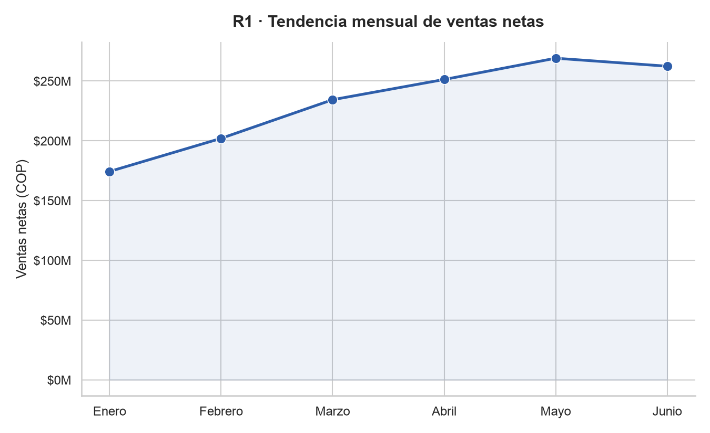
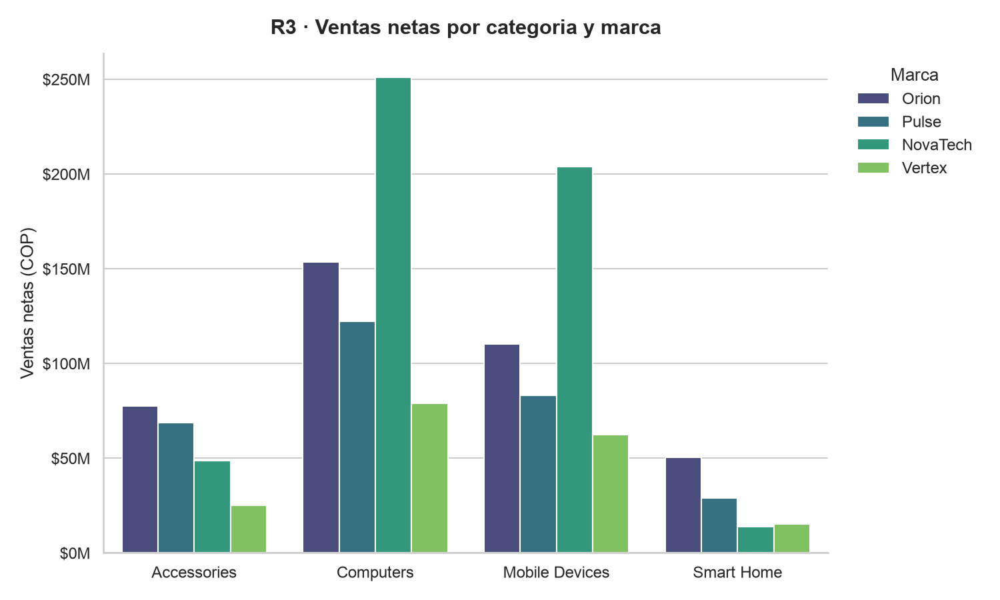

# Lab 2 – ETL & Dimensional Modeling: Sales Data Mart

## 1. Project Objective and Business Scenario

A retail technology company operates two physical stores and one national online store. Management wants to consolidate six months of sales information into a Data Warehouse to support recurring analytical queries and future dashboards. The analytical solution must be designed around the business questions below. The model should contain the data necessary to answer them, without simply copying every source field into the Data Warehouse.
## 2. System Architecture / Pipeline Diagram


## 3. Five Business Requirements

| # | Business Requirement |
|---|---|
| R1 | Monitor monthly net sales trends and identify periods of growth or decline. *(date, sales)* |
| R2 | Compare sales performance across stores and sales channels over time. *(sales, store, channel, date)* |
| R3 | Identify the best-performing product categories and brands, based on revenue and units sold. *(product category, brand)* |
| R4 | Evaluate promotion performance by comparing sales, units, and discounts across different promotion types. *(promotions)* |
| R5 | Analyze gross revenue and gross margin by product category, store, and month. *(product, store, date)* |


## 4. Business Process and Declared Fact-Table Grain

**Business process:** Retail sales transactions.

**Declared grain:** Each row in `fact_sales` represents one sales line, on a specific date, at a specific store, through a specific sales channel, for a specific product purchased under a specific promotion (including cases with no promotion applied).

## 5. Star Schema Diagram and Design Justification


**Design justification:**
A star schema was chosen because the declared grain of `fact_sales` (one row per sale line, per date/store/channel/product/promotion) maps directly onto a single fact table surrounded by independent, denormalized dimension tables (`dim_dates`, `dim_stores`, `dim_products`, `dim_chanel`, `dim_promotions`). This structure:

- Directly supports all five business requirements, since each requirement only needs a join between `fact_sales` and one or two dimensions (e.g., R1 → `dim_dates`; R2 → `dim_stores` + `dim_chanel`; R3 → `dim_products`; R4 → `dim_promotions`; R5 → `dim_products` + `dim_stores` + `dim_dates`).
- Keeps dimension tables simple and denormalized (no snowflaking), which simplifies queries and improves read performance for analytical/BI workloads.
- Isolates additive numeric measures in the fact table, separate from descriptive attributes, which is the standard pattern for aggregation-heavy analytical queries.

## 6. Description of Dimensions, Facts, and Measures

### Dimensions

| Dimension | Business Question Supported | Main Attributes |
|---|---|---|
| DimDate | What is the sales trend over time? | `date_id`, `year`, `month`, `day` |
| DimStore | Which store generates the most sales? | `store_id`, `store_name`, `city`, `region` |
| DimChannel | Which channel generates the most sales? | `channel_id`, `channel_name` |
| DimProducts | Which products perform best? | `product_id`, `product_name`, `category`, `brand` |
| DimPromotions | Which promotions do customers use the most? | `promotion_id`, `promotion_name`, `discount_pct` |

### Facts / Measures

| Measure | Meaning | Source / Calculation |
|---|---|---|
| Quantity | Number of units sold | Source transaction, `quantity` |
| Gross Sales | Product value without discount | `Quantity × list_price` |
| Net Sales | Sales value after discount | `Quantity × unit_price_sale` |
| Discount Amount | Total discount granted | `Gross Sales − Net Sales` |
| Total Cost | Cost to the company of purchasing/manufacturing the products | `Quantity × unit_cost` |
| Gross Profit | Profit left by each product/transaction | `Net Sales − Total Cost` |

## 7. Load Order and Surrogate-Key Strategy
| Table | Surrogate Key | Natural Key | Generation Strategy |
|---|---|---|---|
| `dim_channels` | `channel_key` | `channel_id` | Auto-incremented integer PK, assigned automatically on insert |
| `dim_stores` | `store_key` | `store_id` | Auto-incremented integer PK |
| `dim_products` | `product_key` | `product_id` | Auto-incremented integer PK |
| `dim_promotions` | `promotion_key` | `promotion_id` | Auto-incremented integer PK |
| `dim_dates` | `date_id` | — | **Derived key**: built directly from the transaction date as `YYYYMMDD` (e.g. `2024-03-15 → 20240315`) instead of an auto-increment value, so it stays human-readable and directly derivable from `sale_date` |
| `fact_sales` | — (no own surrogate key) | `sale_line_id` | References all dimension surrogate keys (`store_key`, `channel_key`, `product_key`, `promotion_key`, `date_id`) as foreign keys |
 
### Dimension Load Process
 
Each `load_*` function reads its slice of `reference_data.json` (or, for dates, the unique dates parsed from `sales_transactions.csv`) and inserts it into its dimension table with `executemany`, letting the database auto-assign the surrogate key on insert. `dim_dates` is the only exception: instead of an auto-increment key, its `date_id` is deterministically derived from each unique `sale_date` (`YYYYMMDD`), together with the corresponding `year`, `month`, and `day` attributes.
 
### Fact Load Process
 
`load_fact_sales()` builds `fact_sales` from the raw sales transactions in three steps:
 
1. **Resolve surrogate keys:** the natural business identifiers from the source data (`store_id`, `channel_id`, `product_id`, `promotion_id`) are resolved to their dimension surrogate keys via `merge` (left join) against the dimension tables already loaded in the database. The transaction date is converted to `date_id` using the same `YYYYMMDD` format as `dim_dates`.
2. **Validate referential integrity:** after the merges, any row whose surrogate key(s) came back as `NaN` is treated as an orphan (no matching dimension record). The load process explicitly checks for this and raises a `ValueError` listing the offending `sale_line_id`s, stopping the load rather than inserting incomplete/unlinked rows.
3. **Calculate measures:** `gross_sales`, `net_sales`, `discount_amount`, `total_cost`, and `gross_profit` are computed from `quantity`, `list_price`, `unit_price_sale`, and `unit_cost` (brought in from `dim_products` during the merge).
Once keys are resolved and measures are calculated, the final rows (`sale_line_id`, `date_id`, `store_key`, `channel_key`, `product_key`, `promotion_key`, `quantity`, and the five calculated measures) are inserted into `fact_sales` in a single batch operation (`executemany`) for performance.
 


## 8. Execution Instructions

Once the environment and dependencies are set up, the full pipeline (dimensions → fact table → downstream steps) is executed with a single command from the project root:
 
```bash
python src/main.py
```
 

## 9. SQL Queries / KPIs Mapped to Business Requirements

| Requirement | Analytical Question | Dimensions Needed | Measures Needed | Expected KPI / Query |
|---|---|---|---|---|
| R1 | What is the monthly trend of net sales? | DimDate | Net Sales | Net Sales grouped by month |
| R2 | How do sales compare across stores and channels over time? | DimStore, DimChannel, DimDate | Net Sales, Quantity | Net Sales by Store and Channel |
| R3 | Which categories and brands perform best? | DimProducts | Net Sales, Quantity | Top categories and brands by units sold |
| R4 | Which promotions are most effective? | DimPromotions | Net Sales, Quantity, Discount Amount | Metric comparison by promotion type |
| R5 | What is the gross margin by category, store, and month? | DimProducts, DimStore, DimDate | Net Sales, Total Cost, Gross Profit | Profit margin (%) |

## 10. Two Analytical Visualizations and Interpretation

Las tendencias de ventas muestran que hubo un aumento constante dentro de los meses de febrero a mayo y hubo una caida en Junio 



Las categorías que más venden son Computers y Mobile Devices, siendo Computers la líder. Smart Home es la categoría con menor desempeño. La marca más representativa es NovaTech, liderando en Computers y Mobile Devices, aunque en Accessories y Smart Home es Orion quien toma el liderazgo.

